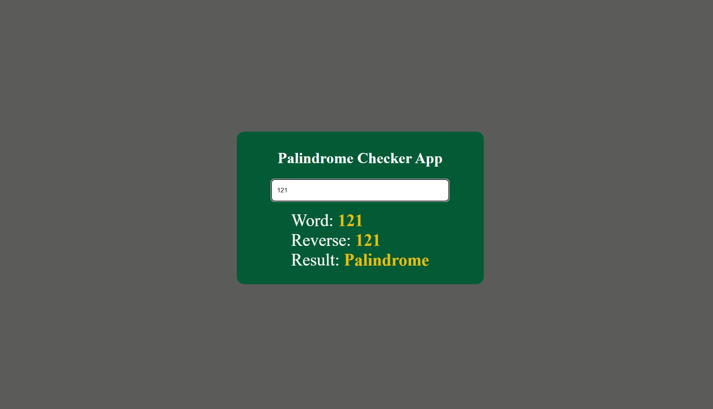
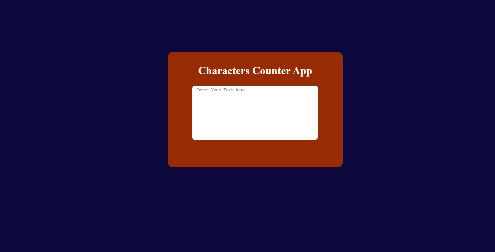
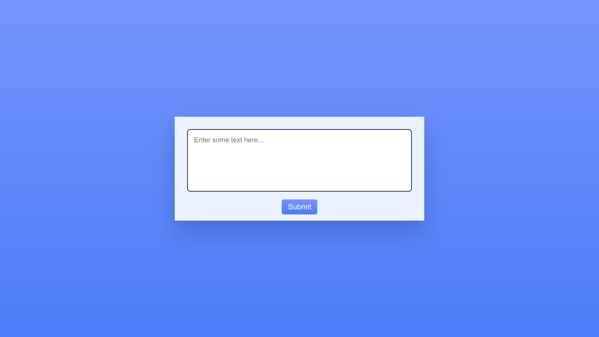
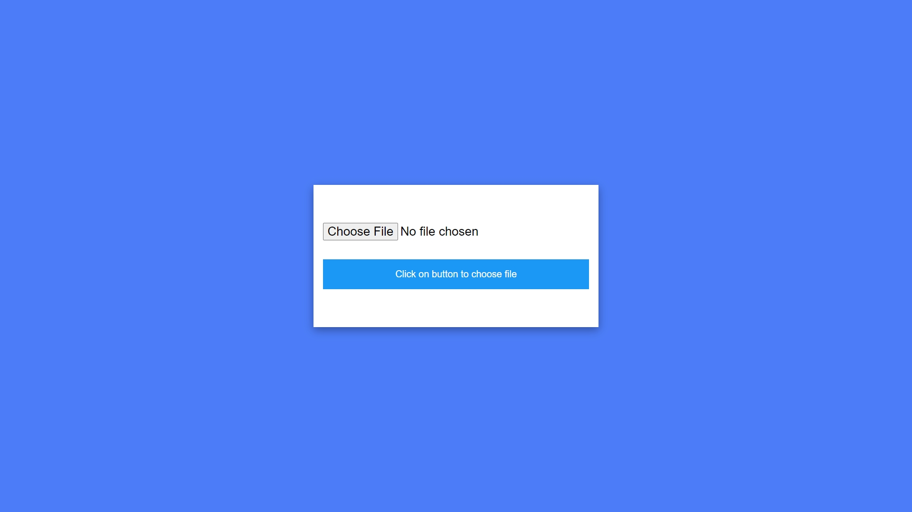

# JAVASCRIPT MINI PROJECTS

 

## About

This repository contains 15 mini projects that are made in HTML, CSS, and JavaScript. The projects range in complexity from simple calculators to complex password generators.

## Screenshots

