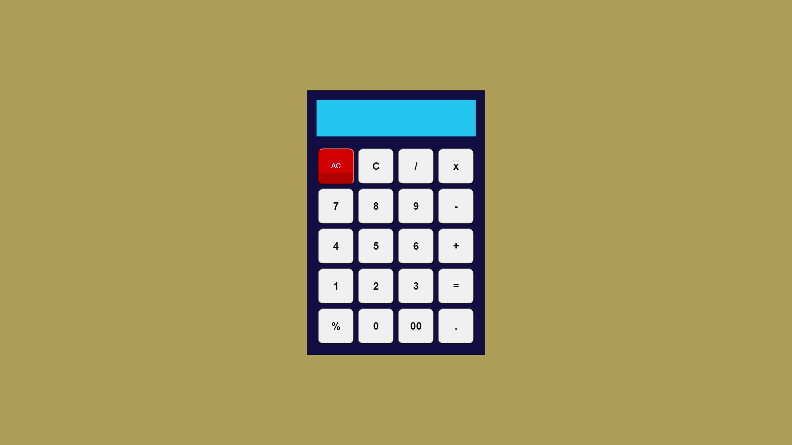
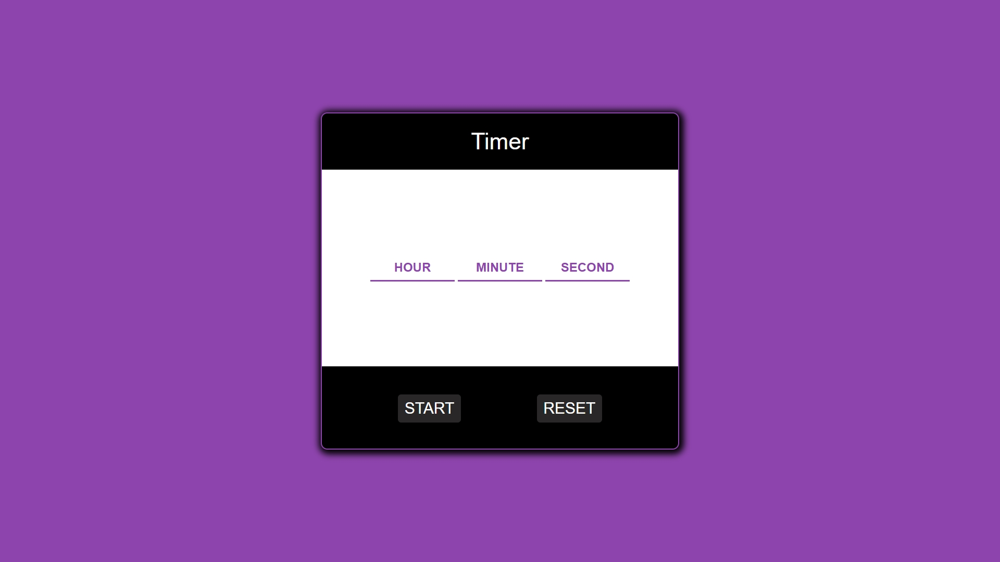
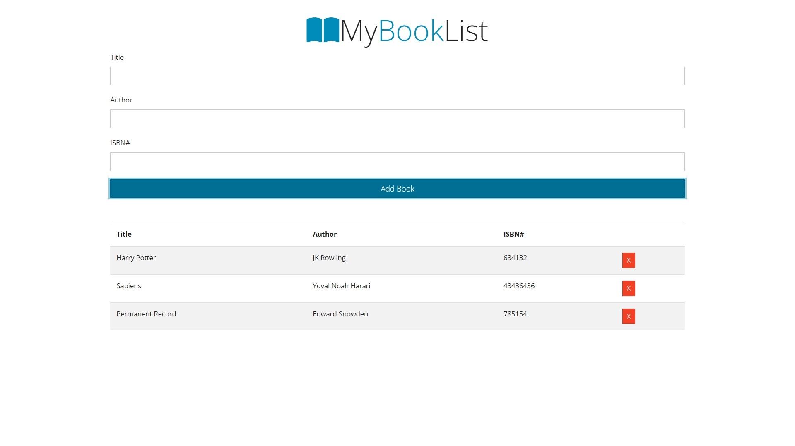
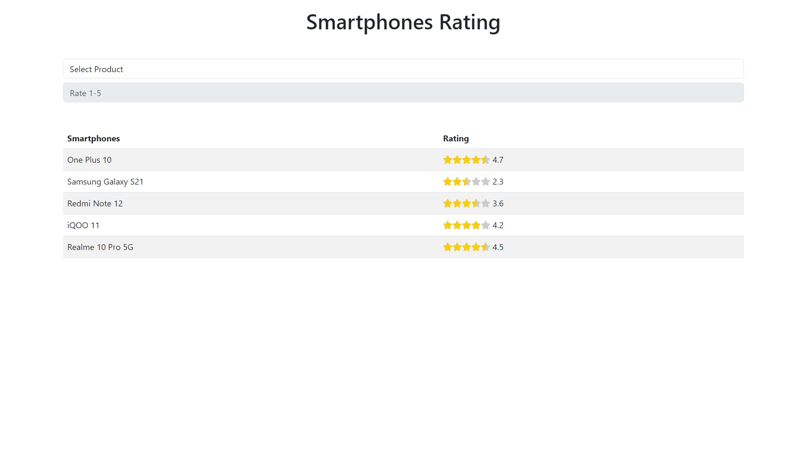
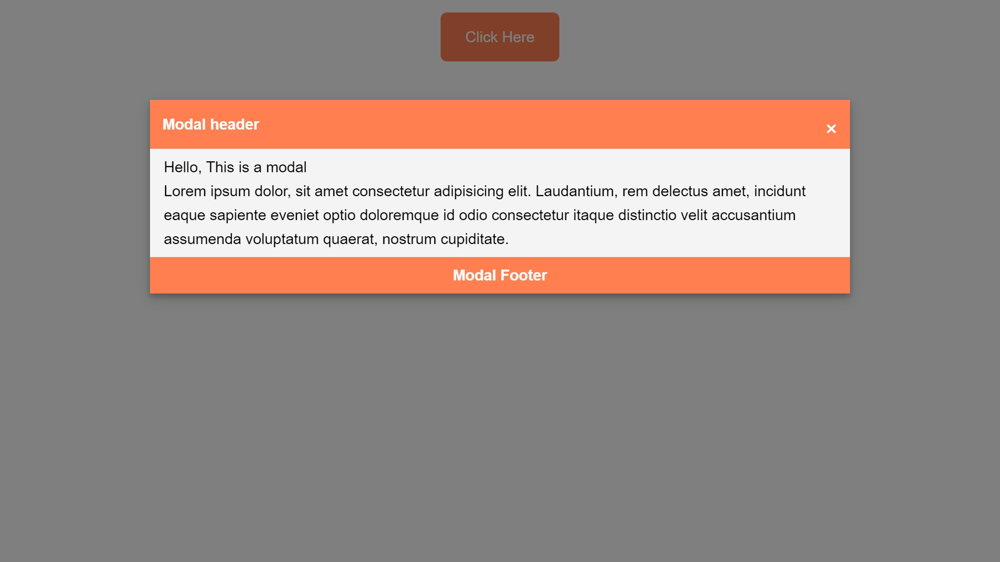
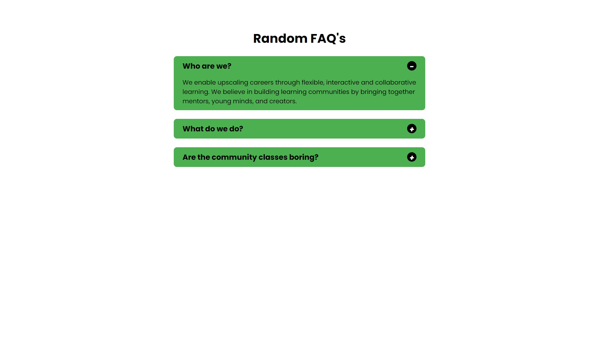
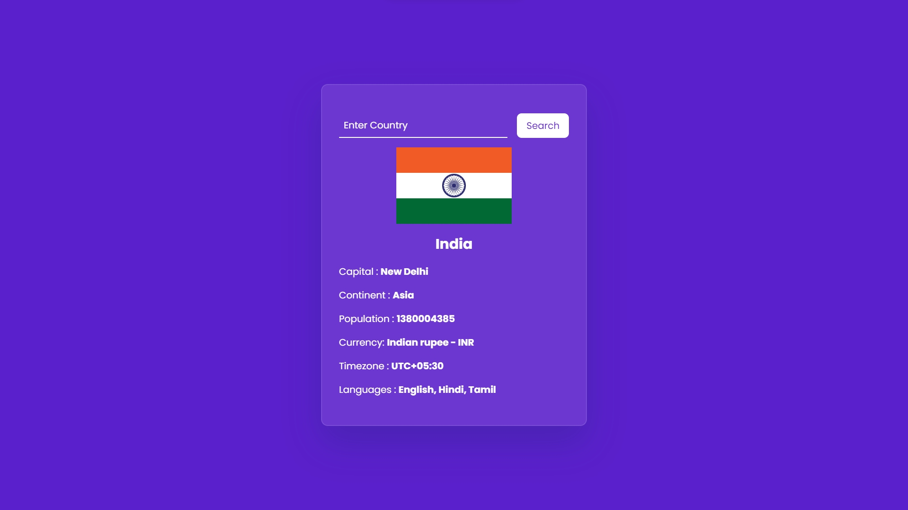

# JAVASCRIPT MINI PROJECTS

 

## About

This repository contains 15 mini projects that are made in HTML, CSS, and JavaScript. The projects range in complexity from simple calculators to complex password generators.

## Screenshots

1. [Typing Game](https://github.com/mk-manishkumar/javascript-mini-projects/tree/main/01TypingGame) - [Live Link](https://js-mini-projects-mk.netlify.app/01typinggame/)
   

<!-- ///////////////////////////// -->

2. [Name Conversion](https://github.com/mk-manishkumar/javascript-mini-projects/tree/main/02NameConversion) - [Live Link](https://js-mini-projects-mk.netlify.app/02nameconversion/)
   

<!-- ///////////////////////////// -->

3. [Password Generator](https://github.com/mk-manishkumar/javascript-mini-projects/tree/main/03PasswordGenerator) - [Live Link](https://js-mini-projects-mk.netlify.app/03passwordgenerator/)

<!-- ///////////////////////////// -->

4. [Calculator](https://github.com/mk-manishkumar/javascript-mini-projects/tree/main/04Calculator) - [Live Link](https://js-mini-projects-mk.netlify.app/04calculator/)

<!-- ///////////////////////////// -->

5. [Rock Paer Scissor](https://github.com/mk-manishkumar/javascript-mini-projects/tree/main/05RockPaperScissor) - [Live Link](https://js-mini-projects-mk.netlify.app/05rockpaperscissor/)

<!-- ///////////////////////////// -->

1. [Joke Generator](https://github.com/mk-manishkumar/javascript-mini-projects/tree/main/06JokesGenerator%20-%20API) - [Live Link](https://js-mini-projects-mk.netlify.app/06jokesgenerator%20-%20api/)

<!-- ///////////////////////////// -->

7. [QR Code Generator](https://github.com/mk-manishkumar/javascript-mini-projects/tree/main/07QRCodeGenerator%20-%20API) - [Live Link](https://js-mini-projects-mk.netlify.app/07qrcodegenerator%20-%20api/)

<!-- ///////////////////////////// -->

8. [See What You Type](https://github.com/mk-manishkumar/javascript-mini-projects/tree/main/08SeeWhatYouType) - [Live Link](https://js-mini-projects-mk.netlify.app/08seewhatyoutype/)

<!-- ///////////////////////////// -->

9. [ToDo](https://github.com/mk-manishkumar/javascript-mini-projects/tree/main/09Todo) - [Live Link](https://js-mini-projects-mk.netlify.app/09todo/)

<!-- ///////////////////////////// -->

10. [Palindrome Checker](https://github.com/mk-manishkumar/javascript-mini-projects/tree/main/10PalindromeChecker) - [Live Link](https://js-mini-projects-mk.netlify.app/10palindromechecker/)

<!-- ///////////////////////////// -->

11. [Count Down Timer](https://github.com/mk-manishkumar/javascript-mini-projects/tree/main/11CountDownTimer) - [Live Link](https://js-mini-projects-mk.netlify.app/11countdowntimer/)

<!-- ///////////////////////////// -->

12. [Word Char Count](https://github.com/mk-manishkumar/javascript-mini-projects/tree/main/12WordCharCounter) - [Live Link](https://js-mini-projects-mk.netlify.app/12wordcharcounter/)

<!-- ///////////////////////////// -->

13. [Text to Speech](https://github.com/mk-manishkumar/javascript-mini-projects/tree/main/13Text2Speech) - [Live Link](https://github.com/mk-manishkumar/javascript-mini-projects/tree/main/13Text2Speech) - [Live Link](https://js-mini-projects-mk.netlify.app/13text2speech/)

<!-- ///////////////////////////// -->

14. [Get File Extension](https://github.com/mk-manishkumar/javascript-mini-projects/tree/main/14GetFileExtension) - [Live Link](https://js-mini-projects-mk.netlify.app/14getfileextension/)

<!-- ///////////////////////////// -->

15. [StopWatch](https://github.com/mk-manishkumar/javascript-mini-projects/tree/main/15StopWatch) - [Live Link](https://js-mini-projects-mk.netlify.app/15stopwatch/)

<!-- ///////////////////////////// -->

16. [BookList App](https://github.com/mk-manishkumar/javascript-mini-projects/tree/main/16BookListApp) - [Live Link](https://js-mini-projects-mk.netlify.app/16booklistapp/)

<!-- ///////////////////////////// -->

17. [Star Rating](https://github.com/mk-manishkumar/javascript-mini-projects/tree/main/17StarRating) - [Live Link](https://js-mini-projects-mk.netlify.app/17starrating/)

<!-- ///////////////////////////// -->

18. [Drag & Drop](https://github.com/mk-manishkumar/javascript-mini-projects/tree/main/18Drag%26Drop)

<!-- ///////////////////////////// -->

19. [Modal](https://github.com/mk-manishkumar/javascript-mini-projects/tree/main/19Modal) - [Live Link](https://js-mini-projects-mk.netlify.app/19modal/)

<!-- ///////////////////////////// -->

20. [Accordion](https://github.com/mk-manishkumar/javascript-mini-projects/tree/main/20Accordion) - [Live Link](https://js-mini-projects-mk.netlify.app/20accordion/)

<!-- ///////////////////////////// -->

21. [Country API](https://github.com/mk-manishkumar/javascript-mini-projects/tree/main/21CountryAPI) - [Live Link](https://js-mini-projects-mk.netlify.app/21countryapi/)

<!-- ///////////////////////////// -->

22. [Recipe API](https://github.com/mk-manishkumar/javascript-mini-projects/tree/main/22ReceipeAPI) - [Live Link](https://js-mini-projects-mk.netlify.app/22receipeapi/)

<!-- ///////////////////////////// -->

23. [Weight Converter](https://github.com/mk-manishkumar/javascript-mini-projects/tree/main/23WeightConverter) - [Live Link](https://js-mini-projects-mk.netlify.app/23weightconverter/)

<!-- ///////////////////////////// -->

24. [Search Filter](https://github.com/mk-manishkumar/javascript-mini-projects/tree/main/24SearchFilter) - [Live Link](https://js-mini-projects-mk.netlify.app/24searchfilter/)

<!-- ///////////////////////////// -->

25. [Live Search Filter](https://github.com/mk-manishkumar/javascript-mini-projects/tree/main/25LiveSearchFilter) - [Live Link](https://js-mini-projects-mk.netlify.app/25livesearchfilter/)

<!-- ///////////////////////////// -->

